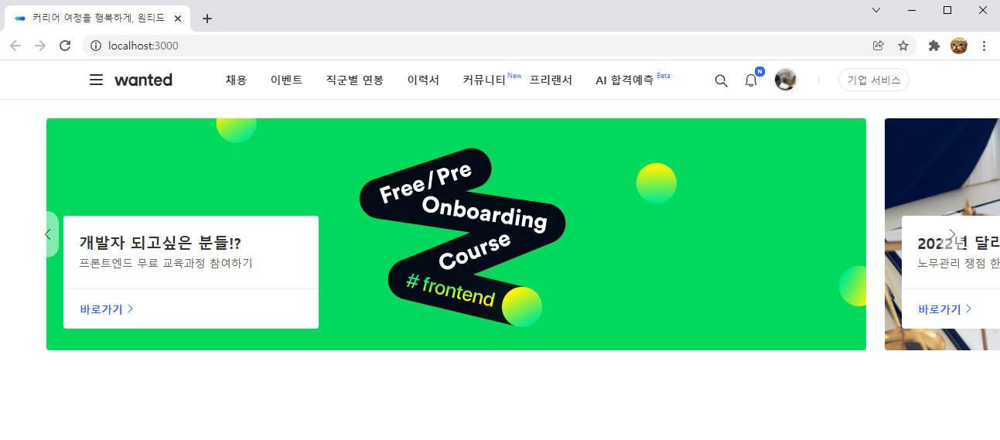

# wanted_pre_onboarding
> 원티드 프리온보딩 코스_클론 코딩 과제

## 실행 방법

1. 우측 상단 code -> Download Zip을 클릭해 zip 파일을 다운받습니다.
2. 압축 파일을 해제합니다.
3. VS Code 또는 git bash로 실행 후 `npm install react-create-app`을 입력해 react-create-app을 설치합니다.
4. 그 후  `npm start` 또는 `yarn start` 를 입력해 로컬 호스트를 실행합니다. 
   ( [http://localhost:3000](http://localhost:3000/) )

## 구현 목록

구현 화면입니다. 구현한 목록은 다음과 같습니다.

- 상단 GNB
  - HTML, CSS 마크업
  - 반응형 구현
- 캐러셀
  - 버튼 클릭 이벤트
- 반응형 웹 구현
  - GNB, 슬라이드 모두 반응형으로 구현

## 배포 주소

배포하는 과정에서 알 수 없는 에러가 발생해 GIF로 대체합니다 😭

- 반응형이 작동하는 영상

- 슬라이드가 작동하는 영상

## 후기

carousel 라이브러리를 사용하지 않고 구현한 것이 처음이라 많이 어려웠습니다. 😢 스스로의 부족한 점을 많이 깨닫게 된 과제였습니다.

특히 carousel의 slide 이벤트를 구현하지 못한게 아쉽습니다. 그 외에도 좌우 버튼 클릭에 따른 슬라이드 이동 이벤트는 구현했지만, 완벽하지 못한 코드라 여러모로 아쉬움이 많이 남습니다.

구현하며 특히 어려웠던 점은,

- 슬라이드 이미지가 끊이지 않고 나오도록 구현 (처음으로 되돌아가기 X)
- 화면 크기에 따라 carousel에 `transform: translateX()` 스타일을 부여하는 것
- 현재 보고있는 슬라이드 이미지만 `filter: brightness(100%)`스타일을 주는 것

이 정도로 정리해볼 수 있을것 같습니다. 이후에도 좀더 시간을 들여 다듬어보고자 합니다.